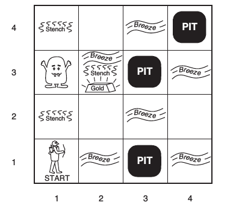

---------------------------------------------------

---------------------------------------------------

# What is this project about?
An attempt to design an agent that can logically navigate the Wumpus World environment described by Stuart Russell and Peter Norvig in their conjointly authored text, *Artificial Intelligence: A Modern Approach*.

A description of a Wumpus World, taken from Russell and Norvig's text more or less verbatim, is given below. I have used ***emphasis*** to mark important points on how my implementation may vary from the official description.

# What is a Wumpus World?

### Informal Description
* A Wumpus World is a cave consisting of rooms connected by passageways.
* Lurking somewhere in the cave is the terrible wumpus, a beast that eats anyone who enters the room. The wumpus can be shot and killed by the agent, but the agent only has one arrow. If shot, the arrow continues until it either hits the wumpus or a wall.
* Some rooms contain bottomless pits that will trap anyone who wanders into these rooms (except for the wumpus, which is too big to fall in). ***(I do not currently intend to allow a single square to contain more than one of the following: wumpus, pit, gold. This may change, however, as I become more aware of the implications of this decision.)***
* The only mitigating feature of this bleak environment is the possibility of finding a heap of gold. 

### Formal Description

We can use the ***PEAS*** (***P***erformance measure, ***E***nvironment, ***A***ctuators, ***S***ensors) description of a task environment to more formally describe the problem.

##### Performance Measure
* +1000 for climbing out of the cave with the gold
* -1000 for falling into a pit or being eaten by the wumpus
* -1 for each action taken
* -10 for using up the arrow

##### Environment
The environment is a 4x4 grid of rooms.
* The agent always starts in the square labeled [1,1]. ***(I will most likely place the agent at [0,0] in a Python array or matrix.)***
* The locations of the gold and the wumpus are chosen randomly, with uniform distribution, from the squares other than the start square.
* In addition, each square other than the start square can be a pit, with probability 0.2.

##### Actuators
* *Forward* - Moves forward
* *TurnLeft* - Turns left by 90 degrees
* *TurnRight* - Turns right by 90 degrees
* *Death* - Agent dies
* *Grab* - Can be used to grab the gold if it is in the same square as the agent
* *Shoot* - Fires an arrow in a straight line in the direction the agent is facing
* *Climb* - Can be used to climb out of the cave, but only from square [1,1] ***(or [0,0] in my implementation)***

##### Sensors
The agent has five sensors, each of which gives a single bit of information (each sensor has a value of True or False).
* *Stench* - True if the agent is in a square directly (not diagonally) adjacent to a square containing a wumpus
* *Breeze* - True if the agent is in a square directly (not diagonally) adjacent to a square containing a pit
* *Glitter* - True if the agent is in a square containing gold
* *Bump* - True on the action following one where the agent bumps into a wall
* *Scream* - True on the action following one where the wumpus is shot by an arrow

### Illustration of a Typical Wumpus World

